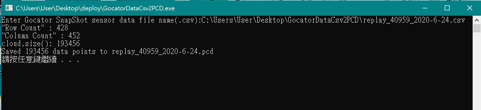

# GocatorDataCsv2PCD
Gocator snapshot csv data transfer to point cloud data(pcd) file.

## 目的
使用Gocator SnapShot系列進行三維掃描後，可使用原廠提供的UI(fig. 1)將三維資料以csv格式儲存下來(fig. 2)。但如要轉成點雲形式，則要解析csv檔中的資料格式(gocator資料樣子大概如下表)。   
| y/x | 1 | 2 | 3 | 4 | 5 | 6 | 7 |
|  -  | - | - | - | - | - | - | - |
|9| | 2| 6| |2|6|4|
|8	|6	||	4	|7|	1|	8|	6|
|7	|7	|7	|9	|4	|9	|1	|6|
|6|	9|	4|	3|	8|	7|	0|	2|

所以這邊寫了一個將Gocator Snapshot取得的csv檔案轉成point cloud data(.pcd)的程式。

*Fig. 1: Gocator GUI*

*Fig. 2: Gocator Data csv*

## 使用方法
開啟**GocatorDataCsv2PCD.exe**檔案，並拖曳或輸入Gocator輸出的csv檔案位置(fig. 3)，接著程式將於同資料夾下生成一個檔名相同的pcd檔案。

>注意：如輸入附檔名不是.csv，則程式會一直要求重新輸入。

*Fig. 3: 程式畫面*